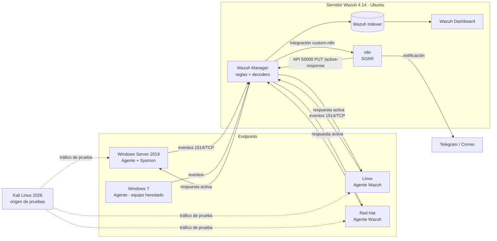

# SOC de laboratorio: Wazuh (SIEM + EDR) con respuesta automatizada en n8n

Proyecto práctico de analista de ciberseguridad: un mini-SOC construido en VMware con **Wazuh** como SIEM/XDR, **Sysmon** como telemetría de endpoint, **respuesta activa** nativa de Wazuh y un **SOAR ligero con n8n** que recibe alertas, las clasifica, notifica al analista y ejecuta contención.

> ⚠️ **Uso exclusivo en laboratorio.** Todas las pruebas de este repositorio se ejecutan contra máquinas propias y aisladas. No las ejecutes contra sistemas de terceros.

---

## Arquitectura



## Flujo de detección y respuesta

1. El agente envía el evento → el manager lo decodifica y aplica reglas (incluidas las de este repo).
2. Si la alerta alcanza el nivel configurado, la **integración `custom-n8n`** la envía por webhook a n8n.
3. n8n **normaliza** la alerta, calcula una **severidad SOC** (Baja/Media/Alta/Crítica), extrae MITRE ATT&CK e IOCs.
4. Notifica al analista (Telegram) y, si es **crítica y contenible**, llama a la **API de Wazuh** para bloquear la IP origen.
5. Toda la evidencia queda en el Dashboard de Wazuh para la investigación.

## Implementación rápida (resumen de comandos)

En el servidor Wazuh, con n8n ya levantado ([capítulo 3](docs/03-instalacion-n8n.md)). El detalle de cada paso, la salida esperada y qué hacer si falla están en el [capítulo 4](docs/04-integracion-wazuh-n8n.md) y el [capítulo 5](docs/05-respuesta-activa.md).

```bash
# 1. Repositorio y variables
git clone https://github.com/ismaDf/wazuh-soc-n8n.git && cd wazuh-soc-n8n
export N8N_URL="http://192.168.100.10:5678/webhook/wazuh-alertas"
export WAZUH_N8N_TOKEN=$(openssl rand -hex 24) && echo "$WAZUH_N8N_TOKEN"   # → credencial "Wazuh Webhook Token" en n8n

# 2. Integración Wazuh → n8n (respaldo + instalación + validación + reinicio)
sudo bash scripts/instalar/instalar-integracion-n8n.sh --url "$N8N_URL" --token "$WAZUH_N8N_TOKEN"

# 3. Reglas personalizadas
sudo install -m 660 -o wazuh -g wazuh wazuh/rules/local_rules.xml /var/ossec/etc/rules/soc_lab_rules.xml

# 4. Respuesta activa
cat wazuh/config/manager-active-response.xml | sudo tee -a /var/ossec/etc/ossec.conf > /dev/null

# 5. Validar y reiniciar
sudo /var/ossec/bin/wazuh-analysisd -t && sudo systemctl restart wazuh-manager

# 6. Prueba de extremo a extremo
curl -s -X POST "$N8N_URL" -H "Content-Type: application/json" \
     -H "X-Wazuh-Token: $WAZUH_N8N_TOKEN" -d @scripts/pruebas/alerta-ejemplo.json
sudo tail -f /var/ossec/logs/integrations.log
```

## Contenido del repositorio

| Ruta | Qué contiene |
|---|---|
| [`docs/`](docs/) | Manual técnico guiado, capítulo por capítulo |
| [`docs/casos-de-uso/`](docs/casos-de-uso/) | 8 casos de uso con contexto real, MITRE, detección, respuesta y prueba |
| [`wazuh/rules/`](wazuh/rules/) | Reglas personalizadas (`local_rules.xml`) |
| [`wazuh/integrations/`](wazuh/integrations/) | Script de integración Wazuh → n8n |
| [`wazuh/active-response/`](wazuh/active-response/) | Scripts de respuesta activa |
| [`wazuh/config/`](wazuh/config/) | Bloques listos para agregar a `ossec.conf` (respuesta activa, VirusTotal) y `agent.conf` (Windows y Linux) |
| [`n8n/`](n8n/) | `docker-compose.yml` y workflows importables |
| [`scripts/instalar/`](scripts/instalar/) | Instalador de la integración Wazuh → n8n (con respaldo y validación) |
| [`scripts/pruebas/`](scripts/pruebas/) | Pruebas controladas para validar cada caso de uso |
| [`evidencias/`](evidencias/) | Capturas y resultados de tus pruebas |

## Manual (orden de lectura)

| # | Capítulo |
|---|---|
| 0 | [Arquitectura y laboratorio](docs/00-arquitectura.md) |
| 1 | [Verificación del despliegue actual de Wazuh](docs/01-verificacion-wazuh.md) |
| 2 | [Sysmon y telemetría EDR en Windows](docs/02-sysmon-edr.md) |
| 3 | [Instalación de n8n con Docker](docs/03-instalacion-n8n.md) |
| 4 | [Integración Wazuh → n8n — guía técnica paso a paso](docs/04-integracion-wazuh-n8n.md) |
| 5 | [Respuesta activa (Wazuh + n8n) — paso a paso](docs/05-respuesta-activa.md) |
| 6 | [Casos de uso](docs/06-casos-de-uso.md) |
| 7 | [Pruebas, evidencias y métricas](docs/07-pruebas-y-evidencias.md) |
| 8 | [Solución de problemas](docs/08-troubleshooting.md) |
| 9 | [Publicar el proyecto en GitHub](docs/09-publicar-en-github.md) |

## Casos de uso

| ID | Caso | Endpoint | MITRE ATT&CK | Respuesta |
|---|---|---|---|---|
| UC-01 | Fuerza bruta SSH | Linux, Red Hat | T1110.001 | Bloqueo de IP (firewall-drop / firewalld-drop) + aviso |
| UC-02 | Fuerza bruta RDP / password spraying | Windows Server 2019 | T1110.001, T1110.003 | Bloqueo de IP (netsh) + aviso |
| UC-03 | Malware detectado (FIM + VirusTotal) | Linux, Red Hat | T1204.002 | Eliminación del archivo + aviso |
| UC-04 | Cuenta creada y agregada a Administradores | Windows Server 2019, Windows 7 | T1136.001, T1098 | Aviso crítico para validación |
| UC-05 | PowerShell codificado / ofuscado | Windows Server 2019 | T1059.001, T1027 | Aviso crítico |
| UC-06 | Borrado de registros de eventos | Windows Server 2019, Windows 7 | T1070.001 | Aviso crítico |
| UC-07 | Persistencia por cron / cambios en cuentas Linux | Linux, Red Hat | T1053.003, T1136.001 | Aviso + revisión FIM |
| UC-08 | Sistema heredado sin soporte y vulnerable | Windows 7 | T1190, T1210 | Aviso + plan de aislamiento |

## Tecnologías

Wazuh 4.14 · Ubuntu · Red Hat · Windows Server 2019 · Windows 7 · Kali Linux 2026 · Sysmon · n8n · Docker · Telegram Bot API · MITRE ATT&CK · VMware Workstation

## Autor

Proyecto de portafolio — Analista de Ciberseguridad. Licencia [MIT](LICENSE).
