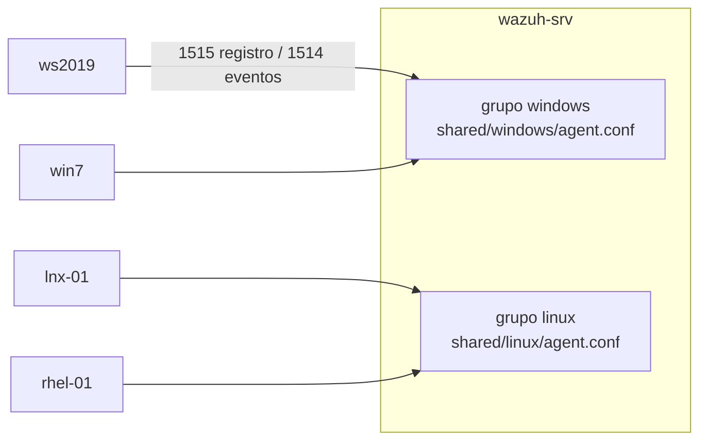

# 3. Despliegue de agentes Wazuh en los clientes — Guía paso a paso

El manager ya está instalado y verificado (capítulo 2). Aquí se instala y registra el agente en los cuatro clientes, cada uno en su **grupo** para recibir la configuración EDR que le corresponde (capítulo 4).



## Mapa de la guía

| Paso | Dónde | Qué haces | Punto de control |
|---|---|---|---|
| 1 | wazuh-srv | Anotar la versión del manager | `VERSION=4.14.x` |
| 2 | wazuh-srv | Crear los grupos `windows` y `linux` | `agent_groups -l` los lista |
| 3 | lnx-01, rhel-01 | Instalar el agente Linux | `Connected to the server` |
| 4 | ws2019 | Instalar el agente Windows | `Connected to the server` |
| 5 | win7 | Instalar el agente (procedimiento para Windows 7) | `Connected to the server` |
| 6 | wazuh-srv | Verificar agentes, grupos y sincronización | 4 agentes `Active` en su grupo |

> **Regla de oro de versiones:** el agente debe tener una versión **igual o menor** que la del manager. Un agente más nuevo que el manager puede no conectarse.

---

## Paso 1 · Versión del manager

En `wazuh-srv`:

```bash
sudo /var/ossec/bin/wazuh-control info | grep VERSION
```

**Salida esperada:** `WAZUH_VERSION="v4.14.7"` (por ejemplo). Usa **ese número sin la `v`** en todos los comandos de este capítulo:

```bash
export WVER=4.14.7     # ← tu versión
```

## Paso 2 · Crear los grupos de agentes

Los grupos permiten enviar una configuración distinta a Windows y a Linux desde el manager.

```bash
sudo /var/ossec/bin/agent_groups -a -g windows -q
sudo /var/ossec/bin/agent_groups -a -g linux -q
sudo /var/ossec/bin/agent_groups -l
```

**Salida esperada:**

```
Groups (3):
  default (0)
  linux (0)
  windows (0)
```

Cada grupo tiene su carpeta en `/var/ossec/etc/shared/<grupo>/`; ahí irá el `agent.conf` del capítulo 4.

### (Opcional) Contraseña de registro

Por defecto cualquier equipo que alcance el puerto 1515 puede registrarse. Para exigir una contraseña:

```bash
openssl rand -hex 16 | sudo tee /var/ossec/etc/authd.pass
sudo chmod 640 /var/ossec/etc/authd.pass && sudo chown root:wazuh /var/ossec/etc/authd.pass
sudo sed -i 's#<use_password>no</use_password>#<use_password>yes</use_password>#' /var/ossec/etc/ossec.conf
sudo systemctl restart wazuh-manager
sudo cat /var/ossec/etc/authd.pass        # úsala como --password / -Password / WAZUH_REGISTRATION_PASSWORD
```

## Paso 3 · Agentes Linux (`lnx-01` y `rhel-01`)

Lleva el repositorio a cada equipo (`git clone https://github.com/ismaDf/wazuh-soc-n8n.git`) o copia solo el instalador con `scp`.

### Opción A — Instalador

```bash
# lnx-01
sudo bash scripts/instalar/instalar-agente-linux.sh --manager 192.168.100.10 --version 4.14.7 --nombre lnx-01 --grupo linux

# rhel-01
sudo bash scripts/instalar/instalar-agente-linux.sh --manager 192.168.100.10 --version 4.14.7 --nombre rhel-01 --grupo linux
```

El script detecta `apt` o `dnf`, agrega el repositorio oficial, instala **la versión exacta**, registra el agente en el grupo, arranca el servicio, desactiva el repositorio para evitar actualizaciones accidentales y verifica la conexión.

**Salida esperada (final):**

```
[OK] Servicio wazuh-agent activo
[OK] 2026/10/02 19:20:15 wazuh-agentd: INFO: (4102): Connected to the server ([192.168.100.10]:1514/tcp).
[OK] Listo. En el manager confirma con: sudo /var/ossec/bin/agent_control -l
```

### Opción B — Manual

**Ubuntu / Debian (`lnx-01`):**

```bash
sudo apt-get install -y gnupg apt-transport-https curl
curl -s https://packages.wazuh.com/key/GPG-KEY-WAZUH | sudo gpg --no-default-keyring --keyring gnupg-ring:/usr/share/keyrings/wazuh.gpg --import
sudo chmod 644 /usr/share/keyrings/wazuh.gpg
echo "deb [signed-by=/usr/share/keyrings/wazuh.gpg] https://packages.wazuh.com/4.x/apt/ stable main" | sudo tee /etc/apt/sources.list.d/wazuh.list
sudo apt-get update

sudo WAZUH_MANAGER="192.168.100.10" WAZUH_AGENT_NAME="lnx-01" WAZUH_AGENT_GROUP="linux" \
     apt-get install -y wazuh-agent=4.14.7-1

sudo systemctl daemon-reload && sudo systemctl enable --now wazuh-agent

# Evitar actualizaciones accidentales
sudo sed -i "s/^deb /#deb /" /etc/apt/sources.list.d/wazuh.list
echo "wazuh-agent hold" | sudo dpkg --set-selections
```

**Red Hat (`rhel-01`):**

```bash
sudo rpm --import https://packages.wazuh.com/key/GPG-KEY-WAZUH
sudo tee /etc/yum.repos.d/wazuh.repo > /dev/null <<'EOF'
[wazuh]
gpgcheck=1
gpgkey=https://packages.wazuh.com/key/GPG-KEY-WAZUH
enabled=1
name=EL-$releasever - Wazuh
baseurl=https://packages.wazuh.com/4.x/yum/
priority=1
EOF
# En RHEL 8 reemplaza la línea priority=1 por protect=1

sudo WAZUH_MANAGER="192.168.100.10" WAZUH_AGENT_NAME="rhel-01" WAZUH_AGENT_GROUP="linux" \
     dnf install -y wazuh-agent-4.14.7-1

sudo systemctl daemon-reload && sudo systemctl enable --now wazuh-agent
sudo sed -i "s/^enabled=1/enabled=0/" /etc/yum.repos.d/wazuh.repo
```

**Verificación en el agente:**

```bash
sudo systemctl status wazuh-agent --no-pager | head -5
sudo grep -E "Connected to the server|ERROR" /var/ossec/logs/ossec.log | tail -3
```

## Paso 4 · Agente en Windows Server 2019 (`ws2019`)

### Opción A — Instalador

Copia `scripts\instalar\instalar-agente-windows.ps1` al servidor y, en PowerShell **como Administrador**:

```powershell
powershell -ExecutionPolicy Bypass -File .\instalar-agente-windows.ps1 -Manager 192.168.100.10 -Version 4.14.7 -Nombre ws2019 -Grupo windows
```

**Salida esperada (final):**

```
Name     Status  StartType
----     ------  ---------
WazuhSvc Running Automatic
[OK] 2026/10/02 19:25:41 wazuh-agent: INFO: (4102): Connected to the server ([192.168.100.10]:1514/tcp).
```

### Opción B — Manual

```powershell
[Net.ServicePointManager]::SecurityProtocol = [Net.SecurityProtocolType]::Tls12
Invoke-WebRequest -Uri https://packages.wazuh.com/4.x/windows/wazuh-agent-4.14.7-1.msi -OutFile $env:TEMP\wazuh-agent.msi -UseBasicParsing

msiexec.exe /i $env:TEMP\wazuh-agent.msi /q WAZUH_MANAGER="192.168.100.10" WAZUH_AGENT_NAME="ws2019" WAZUH_AGENT_GROUP="windows"
Start-Sleep 20
Start-Service WazuhSvc
Get-Service WazuhSvc
Select-String -Path "C:\Program Files (x86)\ossec-agent\ossec.log" -Pattern "Connected to the server|ERROR" | Select-Object -Last 3
```

> El servicio se llama **`WazuhSvc`** (en pantalla aparece como "Wazuh"). Los archivos del agente quedan en `C:\Program Files (x86)\ossec-agent\`.

## Paso 5 · Agente en Windows 7 (`win7`)

Windows 7 tiene dos limitaciones para instalar: PowerShell 2.0 (sin `Invoke-WebRequest`) y TLS antiguo, que puede impedir descargar desde `packages.wazuh.com`. La solución es **servir el instalador desde `wazuh-srv`** dentro de la red del laboratorio.

**5.1 En `wazuh-srv` — descargar y servir el MSI temporalmente:**

```bash
mkdir -p ~/instaladores && cd ~/instaladores
curl -fLO https://packages.wazuh.com/4.x/windows/wazuh-agent-4.14.7-1.msi
sha256sum wazuh-agent-4.14.7-1.msi          # anota el hash
sudo ufw allow from 192.168.100.21 to any port 8000 proto tcp   # si usas ufw
python3 -m http.server 8000 --bind 192.168.100.10
```

Deja esa terminal abierta.

**5.2 En `win7` — CMD como Administrador:**

```bat
bitsadmin /transfer wazuh /download /priority normal http://192.168.100.10:8000/wazuh-agent-4.14.7-1.msi C:\Windows\Temp\wazuh-agent.msi
certutil -hashfile C:\Windows\Temp\wazuh-agent.msi SHA256

msiexec.exe /i C:\Windows\Temp\wazuh-agent.msi /q /l*v C:\Windows\Temp\wazuh-install.log WAZUH_MANAGER="192.168.100.10" WAZUH_AGENT_NAME="win7" WAZUH_AGENT_GROUP="windows"
net start WazuhSvc
findstr /C:"Connected to the server" /C:"ERROR" "C:\Program Files (x86)\ossec-agent\ossec.log"
```

Compara el hash de `certutil` con el que anotaste en el servidor: deben ser idénticos.

**5.3 En `wazuh-srv` — cerrar el servidor temporal:** `Ctrl+C` en la terminal del paso 5.1 y, si abriste el puerto, `sudo ufw delete allow from 192.168.100.21 to any port 8000 proto tcp`.

> Si `msiexec` falla, busca la causa en `C:\Windows\Temp\wazuh-install.log` (busca "Return value 3"). Lo más común en Windows 7 es que falten actualizaciones del sistema; instala las acumulativas de SP1 disponibles para tu laboratorio y vuelve a intentar.

## Paso 6 · Verificar desde el manager

```bash
sudo /var/ossec/bin/agent_control -l
```

**Salida esperada:**

```
Wazuh agent_control. List of available agents:
   ID: 000, Name: wazuh-srv (server), IP: 127.0.0.1, Active/Local
   ID: 001, Name: ws2019, IP: any, Active
   ID: 002, Name: win7, IP: any, Active
   ID: 003, Name: lnx-01, IP: any, Active
   ID: 004, Name: rhel-01, IP: any, Active
```

Anota los IDs: el bloque `CFG` del workflow de n8n (`agentesRhel`) y las pruebas los usan.

Grupos asignados:

```bash
sudo /var/ossec/bin/agent_groups -l -g windows
sudo /var/ossec/bin/agent_groups -l -g linux
```

Información detallada de un agente (versión, SO detectado, último contacto):

```bash
sudo /var/ossec/bin/agent_control -i 002
```

En el Dashboard: **Agents management → Summary**: los 4 agentes en verde con su sistema operativo.

| Si ves | Causa probable | Solución |
|---|---|---|
| Agente `Never connected` | Puerto 1514 bloqueado o IP del manager incorrecta | Paso 5 del capítulo 1; revisa `<address>` en el `ossec.conf` del agente |
| `Disconnected` tras un rato | Hora desincronizada o red | Paso 4 del capítulo 1 |
| `Invalid password` en el log del agente | Contraseña de registro activada | Reinstala pasando la contraseña |
| `Duplicate agent name` | Ya existía un agente con ese nombre | `sudo /var/ossec/bin/manage_agents -r <ID>` en el manager y reinstala |
| Agente en grupo `default` | Faltó `WAZUH_AGENT_GROUP` | `sudo /var/ossec/bin/agent_groups -a -i <ID> -g windows -q` (o `linux`) |

## Desinstalar un agente (si necesitas empezar de nuevo)

| Sistema | Comando |
|---|---|
| Ubuntu/Debian | `sudo apt-get remove --purge wazuh-agent` |
| Red Hat | `sudo dnf remove wazuh-agent` |
| Windows | `msiexec.exe /x C:\Windows\Temp\wazuh-agent.msi /q` (o desde *Programas y características*) |
| Manager (borrar el registro) | `sudo /var/ossec/bin/manage_agents -r <ID>` |

## Checklist del capítulo

- [ ] Versión del manager anotada y usada en todas las instalaciones
- [ ] Grupos `windows` y `linux` creados
- [ ] `ws2019` y `win7` en el grupo `windows`; `lnx-01` y `rhel-01` en `linux`
- [ ] Los 4 agentes `Active` en `agent_control -l`
- [ ] Repositorio desactivado en los agentes Linux
- [ ] Servidor HTTP temporal cerrado tras instalar `win7`
