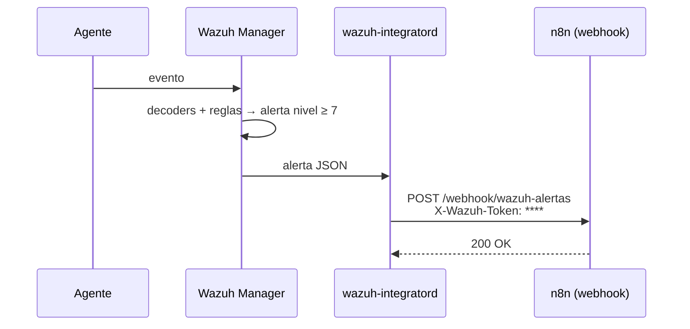

# 4. Integración Wazuh → n8n

Objetivo: que **cada alerta de nivel ≥ 7** llegue a n8n en segundos, autenticada con un token compartido.



## 4.1 Instalar el script de integración en el manager

En `wazuh-srv`, desde la carpeta del repositorio:

```bash
sudo cp wazuh/integrations/custom-n8n.py /var/ossec/integrations/custom-n8n.py

# Wrapper: Wazuh ejecuta "custom-n8n", que llama a custom-n8n.py con el Python del framework
sudo cp /var/ossec/integrations/slack /var/ossec/integrations/custom-n8n

sudo chown root:wazuh /var/ossec/integrations/custom-n8n /var/ossec/integrations/custom-n8n.py
sudo chmod 750 /var/ossec/integrations/custom-n8n /var/ossec/integrations/custom-n8n.py
```

> El wrapper `slack` es un script genérico: ejecuta `<su nombre>.py` con el Python embebido de Wazuh, que ya trae `requests`. Por eso basta con copiarlo con otro nombre.

## 4.2 Configurar la integración

Edita `/var/ossec/etc/ossec.conf` y agrega el bloque `<integration>` de [`wazuh/config/manager-ossec.conf`](../wazuh/config/manager-ossec.conf):

```xml
<integration>
  <name>custom-n8n</name>
  <hook_url>http://N8N_IP:5678/webhook/wazuh-alertas</hook_url>
  <api_key>TOKEN_COMPARTIDO</api_key>
  <level>7</level>
  <alert_format>json</alert_format>
</integration>
```

- `TOKEN_COMPARTIDO` = el mismo valor que pusiste en la credencial **Wazuh Webhook Token** de n8n (capítulo 3.4).
- `level 7` filtra el ruido. Si quieres solo un caso de uso, puedes usar `<rule_id>` o `<group>` en su lugar.

Reinicia:

```bash
sudo systemctl restart wazuh-manager
```

## 4.3 Importar el workflow de triage en n8n

1. n8n → **Workflows → Import from File** → [`n8n/workflows/01-triage-respuesta-wazuh.json`](../n8n/workflows/01-triage-respuesta-wazuh.json).
2. Abre el nodo **Webhook Wazuh** → selecciona la credencial `Wazuh Webhook Token`.
3. Abre **Normalizar alerta** y edita el bloque `CFG` (IP del API, allowlist, IDs de agentes Red Hat).
4. En los nodos **Telegram**, selecciona la credencial y reemplaza `-100XXXXXXXXXX` por tu `chat_id`.
5. En **Autenticar API Wazuh**, selecciona la credencial `Wazuh API`.
6. **Guarda** y activa el workflow (interruptor *Active*). Solo activado responde la URL `/webhook/...`; la URL `/webhook-test/...` solo funciona con el editor en "Listen for test event".

### Qué hace cada nodo

| Nodo | Función |
|---|---|
| Webhook Wazuh | Recibe la alerta y valida el header `X-Wazuh-Token` |
| Normalizar alerta | Extrae campos clave, calcula severidad SOC, IP origen (Linux `data.srcip` / Windows `win.eventdata.ipAddress`), MITRE, decide si notificar (anti-spam 5 min) y si contener |
| ¿Notificar? → Telegram | Envía el aviso formateado al grupo del SOC |
| ¿Contener? → Autenticar → Bloquear IP | Pide token JWT al API y ejecuta `PUT /active-response` en el agente afectado |
| Confirmar contención | Informa el resultado (éxito o error) con el ID de alerta |

## 4.4 Prueba de extremo a extremo

1. **Prueba directa del webhook** (desde `wazuh-srv`), con una alerta de ejemplo:

```bash
curl -s -X POST "http://N8N_IP:5678/webhook/wazuh-alertas" \
  -H "Content-Type: application/json" \
  -H "X-Wazuh-Token: TOKEN_COMPARTIDO" \
  -d @scripts/pruebas/alerta-ejemplo.json
```

Debe llegar el mensaje a Telegram. Si devuelve `403`, el token no coincide.

2. **Prueba real**: genera un evento de nivel ≥ 7 (por ejemplo UC-01) y revisa:

```bash
sudo tail -f /var/ossec/logs/integrations.log
```

Debes ver `alerta ... enviada (HTTP 200)`.

3. En n8n → **Executions** verás cada ejecución con los datos de cada nodo: es tu evidencia para el portafolio.

## 4.5 Workflows complementarios

| Workflow | Disparador | Qué hace |
|---|---|---|
| [`02-reporte-diario.json`](../n8n/workflows/02-reporte-diario.json) | Diario 08:00 | Consulta el Indexer y envía resumen de 24 h: totales por severidad, top reglas, equipos, IPs y técnicas MITRE |
| [`03-sistemas-obsoletos-uc08.json`](../n8n/workflows/03-sistemas-obsoletos-uc08.json) | Lunes 09:00 | Lista agentes por API, detecta SO sin soporte (ej. Windows 7) y revisa si exponen SMB/RDP (caso UC-08) |

Ambos usan IPs de ejemplo (`192.168.100.10`) en las URLs: cámbialas por las tuyas. El usuario `n8n-soar` necesita además el permiso `syscollector:read` para el workflow 03.
