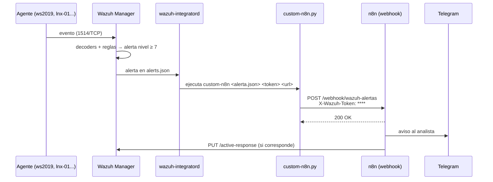

# 4. Integración Wazuh (SIEM) → n8n (SOAR) — Guía técnica paso a paso

Al terminar este capítulo, **cada alerta de nivel ≥ 7** de Wazuh llegará a n8n en segundos, autenticada con un token, y n8n la notificará por Telegram y podrá contener la amenaza.



## Mapa de la guía

| Paso | Dónde | Qué haces | Punto de control |
|---|---|---|---|
| 0 | wazuh-srv | Definir variables | `echo $N8N_URL` muestra la URL |
| 1 | wazuh-srv | Descargar el repositorio | Existe `~/wazuh-soc-n8n` |
| 2 | wazuh-srv | Generar el token compartido | Token de 48 caracteres |
| 3 | n8n (navegador) | Crear las 4 credenciales | Aparecen en *Credentials* |
| 4 | n8n | Importar y configurar el workflow 01 | Workflow publicado/activo |
| 5 | wazuh-srv | Probar conectividad manager → n8n | `/healthz` responde 200 |
| 6 | wazuh-srv | Instalar la integración en Wazuh | `Enabling integration for: 'custom-n8n'` |
| 7 | wazuh-srv | Probar el webhook y el script a mano | 403 con token malo, mensaje en Telegram con token bueno |
| 8 | wazuh-srv / Kali | Generar una alerta real | `enviada (HTTP 200)` en integrations.log |
| 9 | todos | Verificar la cadena completa | Tabla de puntos de control |

> **Requisitos previos:** capítulo 1 (Wazuh verificado, usuario de API `n8n-soar`) y capítulo 3 (n8n corriendo en Docker y bot de Telegram creado).

---

## Paso 0 · Variables de la sesión

En `wazuh-srv`, abre una terminal y define estas variables **con tus valores**. Todos los comandos de la guía las usan, así que no cierres esta terminal hasta terminar.

```bash
export WAZUH_IP=192.168.100.10          # IP del manager
export N8N_IP=192.168.100.10            # IP donde corre n8n (puede ser la misma)
export N8N_URL="http://$N8N_IP:5678/webhook/wazuh-alertas"
echo "$N8N_URL"
```

**Salida esperada:** `http://192.168.100.10:5678/webhook/wazuh-alertas`

## Paso 1 · Descargar el repositorio en el servidor

```bash
sudo apt install -y git jq curl
cd ~
git clone https://github.com/ismaDf/wazuh-soc-n8n.git
cd ~/wazuh-soc-n8n
ls
```

**Salida esperada:** `docs  evidencias  LICENSE  n8n  README.md  scripts  wazuh`

## Paso 2 · Generar el token compartido

Este token autentica a Wazuh ante n8n. Va en dos lugares: en `ossec.conf` y en la credencial de n8n.

```bash
export WAZUH_N8N_TOKEN=$(openssl rand -hex 24)
echo "$WAZUH_N8N_TOKEN"
```

Copia el valor: lo pegarás en n8n en el paso 3.

> No uses espacios ni caracteres especiales: Wazuh pasa el token como argumento de línea de comandos y lo corta en los espacios.

## Paso 3 · Crear las credenciales en n8n

Abre `http://N8N_IP:5678` → menú **Credentials** (o **Overview → Credentials**) → **Create credential**. Crea estas cuatro con el **nombre exacto** de la columna 1:

| Nombre | Tipo (buscar en la lista) | Campos |
|---|---|---|
| `Wazuh Webhook Token` | **Header Auth** | *Name:* `X-Wazuh-Token` · *Value:* el token del paso 2 |
| `Wazuh API` | **Basic Auth** | *User:* `n8n-soar` · *Password:* la del usuario de API (capítulo 1.5) |
| `Wazuh Indexer` | **Basic Auth** | *User:* `admin` (o uno de solo lectura) · *Password:* la del indexer |
| `Telegram SOC Bot` | **Telegram API** | *Access Token:* el token de @BotFather |

Comprueba la credencial de la API de Wazuh desde la terminal antes de seguir:

```bash
curl -sk -u 'n8n-soar:TU_PASSWORD' -X POST \
  "https://$WAZUH_IP:55000/security/user/authenticate?raw=true" | cut -c1-40; echo
```

**Salida esperada:** el inicio de un token JWT, por ejemplo `eyJhbGciOiJFUzUxMiIsInR5cCI6IkpXVCJ9...`. Si ves `"title": "Unauthorized"`, la contraseña o el usuario no son correctos.

## Paso 4 · Importar y configurar el workflow de triage

### 4a. Importar

**Opción A — interfaz:** n8n → **Create workflow** → menú `⋯` (arriba a la derecha) → **Import from File** → elige `n8n/workflows/01-triage-respuesta-wazuh.json` (descárgalo del repositorio a tu PC).

**Opción B — línea de comandos** (en el servidor donde corre el contenedor):

```bash
cd ~/wazuh-soc-n8n
docker cp n8n/workflows/01-triage-respuesta-wazuh.json n8n:/tmp/01.json
docker exec -u node n8n n8n import:workflow --input=/tmp/01.json
```

**Salida esperada:** `Successfully imported 1 workflow.`

Los workflows 02 y 03 se importan igual cambiando el nombre del archivo.

### 4b. Configurar los nodos

Abre el workflow **SOC 01 - Triage y respuesta de alertas Wazuh** y edita:

| Nodo | Qué cambiar |
|---|---|
| **Webhook Wazuh** | *Credential for Header Auth* → `Wazuh Webhook Token`. Verifica *Path* = `wazuh-alertas` y *HTTP Method* = `POST` |
| **Normalizar alerta** | En el bloque `CFG` del código: `wazuhApi`, `dashboard`, `allowlist` (incluye la IP de tu servidor, gateway y tu PC) y `agentesRhel` (ID de `rhel-01`) |
| **Notificar al analista** y **Confirmar contención** | *Credential* → `Telegram SOC Bot` · *Chat ID* → tu `chat_id` (ej. `-1001234567890`) |
| **Autenticar API Wazuh** | *Credential for Basic Auth* → `Wazuh API` |

Para obtener el ID de `rhel-01`:

```bash
sudo /var/ossec/bin/agent_control -l
```

### 4c. Guardar y activar

Pulsa **Save** y luego **Publish** (en versiones anteriores de n8n, el interruptor **Active**). Sin este paso, la URL `/webhook/wazuh-alertas` responde 404.

> `/webhook-test/...` solo funciona mientras el editor está en *Listen for test event*. Wazuh debe usar siempre `/webhook/...`.

## Paso 5 · Probar conectividad manager → n8n

```bash
curl -s -o /dev/null -w "healthz: %{http_code}\n" "http://$N8N_IP:5678/healthz"
```

**Salida esperada:** `healthz: 200`

| Si ves | Causa probable | Solución |
|---|---|---|
| `000` | Firewall o contenedor caído | `docker ps` · `sudo ufw allow from <subred> to any port 5678 proto tcp` |
| `404` en healthz | Versión o ruta distinta | Prueba `curl -I http://$N8N_IP:5678/` (debe responder) |

## Paso 6 · Instalar la integración en Wazuh

Elige **una** de las dos formas. La automática hace lo mismo que la manual, con respaldo y validación incluidos.

### Opción A — Instalador (recomendado)

```bash
cd ~/wazuh-soc-n8n
sudo bash scripts/instalar/instalar-integracion-n8n.sh \
     --url "$N8N_URL" \
     --token "$WAZUH_N8N_TOKEN" \
     --nivel 7
```

**Salida esperada (resumida):**

```
[OK] Requisitos completos
[OK] Respaldo creado: /var/ossec/etc/ossec.conf.bak-20261002-190501
[OK] Script y wrapper instalados
[OK] Bloque <integration> agregado (nivel >= 7)
[OK] Configuración válida
[OK] wazuh-integratord habilitó la integración custom-n8n
[OK] n8n responde en http://192.168.100.10:5678 (HTTP 200)
[OK] Instalación terminada.
```

### Opción B — Manual, comando por comando

**6.1 Respaldar la configuración**

```bash
sudo cp -p /var/ossec/etc/ossec.conf /var/ossec/etc/ossec.conf.bak-$(date +%Y%m%d-%H%M%S)
ls -l /var/ossec/etc/ossec.conf*
```

**6.2 Copiar el script y crear el wrapper**

```bash
cd ~/wazuh-soc-n8n
sudo install -m 750 -o root -g wazuh wazuh/integrations/custom-n8n.py /var/ossec/integrations/custom-n8n.py
sudo install -m 750 -o root -g wazuh /var/ossec/integrations/slack /var/ossec/integrations/custom-n8n
ls -l /var/ossec/integrations/custom-n8n*
```

**Salida esperada:**

```
-rwxr-x--- 1 root wazuh  ... /var/ossec/integrations/custom-n8n
-rwxr-x--- 1 root wazuh  ... /var/ossec/integrations/custom-n8n.py
```

> **¿Por qué copiar `slack`?** En Wazuh 4.14, `/var/ossec/integrations/slack` es un *wrapper* genérico: ejecuta `<su propio nombre>.py` con el Python embebido de Wazuh (que ya trae `requests`). Copiado como `custom-n8n`, ejecuta `custom-n8n.py`. `wazuh-integratord` exige que el nombre de una integración propia empiece con `custom-`.

**6.3 Agregar el bloque `<integration>` a ossec.conf**

Wazuh admite varios bloques `<ossec_config>` en el mismo archivo, así que se agrega uno nuevo al final sin tocar lo existente:

```bash
sudo tee -a /var/ossec/etc/ossec.conf > /dev/null <<EOF

<!-- Integración Wazuh -> n8n -->
<ossec_config>
  <integration>
    <name>custom-n8n</name>
    <hook_url>$N8N_URL</hook_url>
    <api_key>$WAZUH_N8N_TOKEN</api_key>
    <level>7</level>
    <alert_format>json</alert_format>
  </integration>
</ossec_config>
EOF

sudo tail -12 /var/ossec/etc/ossec.conf
```

Verifica que la URL y el token aparezcan **con sus valores** (no como `$N8N_URL`). Si ves el nombre de la variable, la exportaste en otra terminal: repite el paso 0.

Opciones de filtrado del bloque (puedes combinarlas):

| Etiqueta | Ejemplo | Efecto |
|---|---|---|
| `<level>` | `7` | Solo alertas de nivel ≥ 7 |
| `<rule_id>` | `5712,5763,100112` | Solo esas reglas |
| `<group>` | `soc_lab,authentication_failures` | Solo esos grupos |

**6.4 Validar y reiniciar**

```bash
sudo /var/ossec/bin/wazuh-analysisd -t && echo "CONFIG OK"
sudo systemctl restart wazuh-manager
sleep 15
sudo grep -i "integrat" /var/ossec/logs/ossec.log | tail -5
```

**Salida esperada:** `CONFIG OK` y una línea como:

```
2026/10/02 19:05:12 wazuh-integratord: INFO: Enabling integration for: 'custom-n8n'.
```

| Si ves | Solución |
|---|---|
| `File not found inside '/var/ossec/integrations'` | Falta el wrapper `custom-n8n` (sin `.py`): repite 6.2 |
| `Invalid integration` | El `<name>` no empieza con `custom-` |
| `wazuh-analysisd -t` muestra error XML | Restaura el respaldo: `sudo cp -p /var/ossec/etc/ossec.conf.bak-FECHA /var/ossec/etc/ossec.conf` |

## Paso 7 · Probar el webhook y el script a mano

Antes de esperar alertas reales, prueba cada eslabón por separado.

**7.1 Token incorrecto → debe rechazar**

```bash
curl -s -o /dev/null -w "token malo: %{http_code}\n" -X POST "$N8N_URL" \
  -H "Content-Type: application/json" -H "X-Wazuh-Token: incorrecto" -d '{}'
```

**Salida esperada:** `token malo: 403`. Si responde `200`, el nodo Webhook no tiene activada la autenticación *Header Auth*: corrígelo antes de seguir.

**7.2 Token correcto con una alerta de ejemplo → debe llegar a Telegram**

```bash
cd ~/wazuh-soc-n8n
curl -s -X POST "$N8N_URL" \
  -H "Content-Type: application/json" \
  -H "X-Wazuh-Token: $WAZUH_N8N_TOKEN" \
  -d @scripts/pruebas/alerta-ejemplo.json; echo
```

**Salida esperada:** `{"message":"Workflow was started"}` y en Telegram un aviso 🔴 **[CRÍTICA] Wazuh · Regla 100112**.

> La alerta de ejemplo simula un login exitoso tras fuerza bruta desde `192.168.100.50`, así que n8n **también intentará bloquear esa IP** en el agente `001`. Si `001` es tu ws2019 y esa IP es tu Kali, Kali quedará bloqueada: revierte con el comando del capítulo 5.5, o cambia `srcip` e `ipAddress` en el JSON por una IP inexistente del lab (ej. `192.168.100.99`) antes de probar.

**7.3 Ejecutar el script de integración igual que lo hace Wazuh**

```bash
sudo /var/ossec/integrations/custom-n8n \
     ~/wazuh-soc-n8n/scripts/pruebas/alerta-ejemplo.json "$WAZUH_N8N_TOKEN" "$N8N_URL"
echo "código de salida: $?"
sudo tail -3 /var/ossec/logs/integrations.log
```

**Salida esperada:**

```
código de salida: 0
2026-10-03T00:07:41Z custom-n8n: alerta 1759418130.1234567 regla 100112 enviada (HTTP 200)
```

> Si repites la prueba antes de 5 minutos, n8n recibe la alerta pero **no** reenvía el aviso: es el filtro anti-spam (misma regla + agente + IP). Revisa la ejecución en n8n → **Executions**.

## Paso 8 · Generar una alerta real

**Opción rápida (en el propio manager):** 10 intentos SSH con un usuario inexistente contra `localhost` generan la regla 5712 (nivel 10) en el agente `000`:

```bash
for i in $(seq 1 10); do
  ssh -o BatchMode=yes -o StrictHostKeyChecking=no -o ConnectTimeout=3 usuario_inexistente@127.0.0.1 true 2>/dev/null
done
sleep 5
sudo tail -3 /var/ossec/logs/integrations.log
```

(127.0.0.1 está en la allowlist: n8n notifica pero no bloquea.)

**Opción completa (recomendada):** UC-01 desde Kali contra `lnx-01`:

```bash
# En Kali
bash scripts/pruebas/uc01-ssh-intentos-fallidos.sh 192.168.100.30
```

Mientras tanto, en `wazuh-srv` observa la alerta y su envío en tiempo real:

```bash
sudo tail -f /var/ossec/logs/alerts/alerts.json | jq -c 'select(.rule.level>=7) | {id:.rule.id, nivel:.rule.level, agente:.agent.name, ip:.data.srcip}' &
sudo tail -f /var/ossec/logs/integrations.log
# Ctrl+C para salir; luego: kill %1
```

**Salida esperada:**

```
{"id":"5712","nivel":10,"agente":"lnx-01","ip":"192.168.100.50"}
2026-10-03T00:12:03Z custom-n8n: alerta 1759450323.88120 regla 5712 enviada (HTTP 200)
```

## Paso 9 · Verificar la cadena completa

Si algo no llega, recorre los eslabones **en orden** y detente en el primero que falle:

| # | Eslabón | Comando de verificación | Correcto si… |
|---|---|---|---|
| 1 | Agente → manager | `sudo /var/ossec/bin/agent_control -l` | El agente está `Active` |
| 2 | Evento → alerta | `sudo tail -f /var/ossec/logs/alerts/alerts.json \| jq .rule.id` | Aparece la regla esperada |
| 3 | Alerta → integratord | `sudo grep integrator /var/ossec/logs/ossec.log \| tail` | `Enabling integration for: 'custom-n8n'` sin errores |
| 4 | Script → n8n | `sudo tail /var/ossec/logs/integrations.log` | `enviada (HTTP 200)` |
| 5 | n8n procesa | n8n → **Executions** | Ejecución en verde |
| 6 | n8n → Telegram | Nodo *Notificar al analista* | Mensaje recibido |
| 7 | n8n → API Wazuh | Nodo *Bloquear IP* (solo 40112/100112) | `affected_items` con el agente |
| 8 | Respuesta en agente | `sudo tail /var/ossec/logs/active-responses.log` (en el agente) | Línea con la IP bloqueada |

Para ver **qué recibe el script** con más detalle, activa la depuración de integratord temporalmente:

```bash
echo "integrator.debug=2" | sudo tee -a /var/ossec/etc/local_internal_options.conf
sudo systemctl restart wazuh-manager
sudo tail -f /var/ossec/logs/ossec.log | grep -i integrator
# Al terminar, quita la línea y reinicia:
sudo sed -i '/^integrator.debug=2$/d' /var/ossec/etc/local_internal_options.conf
sudo systemctl restart wazuh-manager
```

## Revertir la integración

```bash
ls /var/ossec/etc/ossec.conf.bak-*                     # elige el respaldo
sudo cp -p /var/ossec/etc/ossec.conf.bak-FECHA /var/ossec/etc/ossec.conf
sudo rm -f /var/ossec/integrations/custom-n8n /var/ossec/integrations/custom-n8n.py
sudo systemctl restart wazuh-manager
```

## Workflows complementarios

| Workflow | Disparador | Qué hace | Configurar |
|---|---|---|---|
| [`02-reporte-diario.json`](../n8n/workflows/02-reporte-diario.json) | Diario 08:00 | Consulta el Indexer (9200) y envía el resumen de 24 h: severidades, top reglas, equipos, IPs y técnicas MITRE | URL del indexer, credencial `Wazuh Indexer`, Telegram |
| [`03-sistemas-obsoletos-uc08.json`](../n8n/workflows/03-sistemas-obsoletos-uc08.json) | Lunes 09:00 | Lista agentes por API, detecta SO sin soporte (Windows 7) y revisa si exponen SMB/RDP | URLs del API, credencial `Wazuh API`, Telegram; `n8n-soar` necesita `syscollector:read` |

Prueba la consulta del reporte diario desde la terminal antes de importarlo:

```bash
curl -sk -u 'admin:PASSWORD_INDEXER' "https://$WAZUH_IP:9200/wazuh-alerts-*/_count" \
  -H 'Content-Type: application/json' \
  -d '{"query":{"range":{"timestamp":{"gte":"now-24h"}}}}'
```

**Salida esperada:** `{"count":1234,...}` con el número de alertas de las últimas 24 horas.

## Checklist del capítulo

- [ ] Token generado y guardado en n8n (`Wazuh Webhook Token`)
- [ ] Workflow 01 importado, configurado y publicado/activo
- [ ] `/healthz` responde 200 desde el manager
- [ ] `ossec.log` muestra `Enabling integration for: 'custom-n8n'`
- [ ] Token incorrecto → 403; token correcto → mensaje en Telegram
- [ ] Alerta real → `enviada (HTTP 200)` en `integrations.log`
- [ ] Workflows 02 y 03 importados y probados con **Execute workflow**
