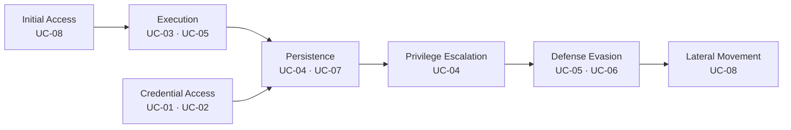

# 6. Casos de uso

Un **caso de uso** de SOC responde cinco preguntas: *¿qué amenaza real?, ¿con qué datos la veo?, ¿con qué lógica la detecto?, ¿qué hago cuando ocurre?, ¿cómo pruebo que funciona?* Cada ficha de este proyecto sigue esa estructura.

## 6.1 Instalar las reglas personalizadas

En `wazuh-srv`:

```bash
sudo cp wazuh/rules/local_rules.xml /var/ossec/etc/rules/local_rules.xml
sudo chown wazuh:wazuh /var/ossec/etc/rules/local_rules.xml
sudo chmod 660 /var/ossec/etc/rules/local_rules.xml

sudo /var/ossec/bin/wazuh-analysisd -t   # sin errores = sintaxis correcta
sudo systemctl restart wazuh-manager
```

> Si ya tenías reglas en `local_rules.xml`, **no lo sobrescribas**: copia el archivo como `/var/ossec/etc/rules/soc_lab_rules.xml`.

Copia también la configuración centralizada de agentes ([`agent-windows.conf`](../wazuh/config/agent-windows.conf) y [`agent-linux.conf`](../wazuh/config/agent-linux.conf)) dentro de `/var/ossec/etc/shared/default/agent.conf`.

## 6.2 Catálogo

| ID | Caso de uso | Endpoint | Táctica MITRE | Técnica | Nivel | Respuesta |
|---|---|---|---|---|---|---|
| [UC-01](casos-de-uso/UC-01-fuerza-bruta-ssh.md) | Fuerza bruta SSH | Linux, Red Hat | Credential Access | T1110.001 | 10 / 12 | Bloqueo nativo + n8n |
| [UC-02](casos-de-uso/UC-02-fuerza-bruta-rdp-windows.md) | Fuerza bruta y password spraying | Windows Server 2019 | Credential Access | T1110.001, T1110.003 | 10–14 | Bloqueo nativo + n8n |
| [UC-03](casos-de-uso/UC-03-malware-virustotal.md) | Malware en descargas | Linux, Red Hat | Execution | T1204.002 | 12 | Eliminación del archivo |
| [UC-04](casos-de-uso/UC-04-cuenta-admin-creada.md) | Cuenta creada y elevada a admin | WS2019, Win7 | Persistence, Priv. Esc. | T1136.001, T1098 | 10 / 14 | Aviso + validación |
| [UC-05](casos-de-uso/UC-05-powershell-codificado.md) | PowerShell codificado / download cradle | Windows Server 2019 | Execution, Defense Evasion | T1059.001, T1027 | 12 / 13 | Aviso crítico |
| [UC-06](casos-de-uso/UC-06-borrado-de-logs.md) | Borrado de registros | WS2019, Win7 | Defense Evasion | T1070.001 | 12 / 14 | Aviso crítico |
| [UC-07](casos-de-uso/UC-07-persistencia-linux.md) | Persistencia cron / cuentas / SSH | Linux, Red Hat | Persistence | T1053.003, T1098.004 | 12 | Aviso + FIM |
| [UC-08](casos-de-uso/UC-08-sistema-heredado.md) | Sistema sin soporte expuesto | Windows 7 | Initial Access, Lateral Mov. | T1190, T1210 | — | Reporte semanal |

## 6.3 Cobertura MITRE ATT&CK



La cadena muestra que los casos no son aislados: un atacante real suele pasar por **UC-02 → UC-04 → UC-05 → UC-06**. Al probarlos en secuencia (capítulo 7) verás en el Dashboard la historia completa de un incidente.

## 6.4 Plantilla para nuevos casos de uso

Usa [`casos-de-uso/PLANTILLA.md`](casos-de-uso/PLANTILLA.md) para documentar casos adicionales con la misma estructura.
