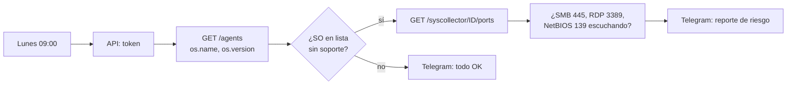

# UC-08 · Sistema heredado sin soporte expuesto en la red

| Campo | Valor |
|---|---|
| Endpoint(s) | `win7` (Windows 7 SP1) |
| Táctica / Técnica MITRE | Initial Access · T1190 Exploit Public-Facing Application · Lateral Movement · T1210 Exploitation of Remote Services |
| Fuente de datos | Inventario del agente (Syscollector: SO, puertos, paquetes) · Vulnerability Detection · SCA |
| Detección | Workflow n8n **03** semanal + Dashboard → Vulnerability Detection |
| Severidad SOC | Alta (riesgo, no incidente) |
| Respuesta automática | Reporte semanal con equipos y servicios expuestos |

## Contexto real

En mayo de 2017, **WannaCry** se propagó por el mundo aprovechando una vulnerabilidad de SMBv1 (MS17-010, explotada con *EternalBlue*). Microsoft había publicado el parche dos meses antes; los más afectados fueron equipos sin actualizar, con gran proporción de Windows 7. Hoy, un Windows 7 sin soporte acumula vulnerabilidades que **nunca** se corregirán: es el eslabón por el que un atacante entra o se mueve lateralmente.

Este caso es distinto de los demás: no detecta un ataque en curso, sino una **condición de riesgo**. Gestionar el riesgo antes del incidente también es trabajo del SOC.

## Lógica de detección

El workflow [`03-sistemas-obsoletos-uc08.json`](../../n8n/workflows/03-sistemas-obsoletos-uc08.json):



Complementos en el Dashboard de Wazuh:

- **Vulnerability Detection**: filtra `agent.name: win7` y ordena por severidad; anota los CVE críticos.
- **Configuration Assessment (SCA)**: puntaje de hardening del equipo.
- **Inventory data**: paquetes y puertos.

## Respuesta

No hay contención automática (no es un incidente). El reporte incluye la acción recomendada: segmentar, bloquear SMB/RDP desde otras redes y planificar la migración.

## Prueba controlada (solo laboratorio)

1. Asegúrate de que el usuario `n8n-soar` tenga `agents:read` y `syscollector:read`.
2. En n8n, abre el workflow 03 y pulsa **Execute workflow** (no hace falta esperar al lunes).
3. Desde `kali`, verifica qué ve un atacante (reconocimiento de servicios, sin explotar nada):

```bash
nmap -Pn -sV -p 135,139,445,3389 192.168.100.21
```

## Evidencia esperada

| Dónde | Qué ver |
|---|---|
| Telegram | 🟠 "UC-08 · Sistemas sin soporte" con `win7`, su SO y puertos expuestos |
| Dashboard → Vulnerability Detection | Lista de CVE de `win7` (captura para el informe) |
| Kali | Puertos 445/3389 abiertos coinciden con el inventario de Wazuh |

## Plan de tratamiento del riesgo (para el informe)

| Opción | Acción concreta en el lab |
|---|---|
| Mitigar | Firewall de Windows: bloquear 445/139/3389 entrantes salvo desde la IP del administrador; deshabilitar SMBv1 |
| Aislar | Mover `win7` a un segmento VMware sin ruta hacia los servidores |
| Monitorear | Mantener el agente Wazuh: aunque no tenga parches, sí tiene visibilidad (UC-04, UC-06) |
| Eliminar | Migrar a un sistema con soporte (opción recomendada) |

## Falsos positivos y ajuste

- Equipos heredados obligatorios (máquinas industriales, software antiguo): documenta la excepción formalmente y mantenlos aislados; el reporte seguirá recordándolos cada semana, lo cual es deseable.
